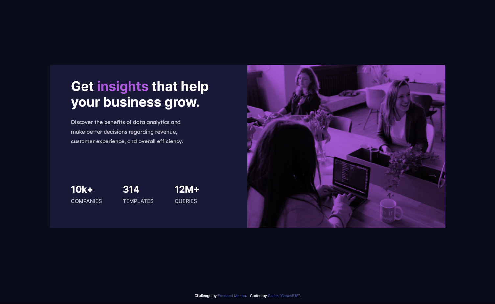

# Frontend Mentor - Stats preview card component solution

This is a solution to the [Stats preview card component challenge on Frontend Mentor](https://www.frontendmentor.io/challenges/stats-preview-card-component-8JqbgoU62). Frontend Mentor challenges help you improve your coding skills by building realistic projects.

## Table of contents

- [Overview](#overview)
  - [The challenge](#the-challenge)
  - [Screenshot](#screenshot)
  - [Links](#links)
- [My process](#my-process)
  - [Built with](#built-with)
  - [What I learned](#what-i-learned)
- [Author](#author)

## Overview

### The challenge

Users should be able to:

- View the optimal layout depending on their device's screen size

### Screenshot

- Dekstop Preview

- Mobile Preview

### Links

- Live Site URL: [First Challanges](https://ganes556.github.io/Challanges/)

## My process

### Built with

- Semantic HTML5 markup
- CSS custom properties
- Flexbox
- CSS Grid
- Mobile-first workflow
- [Bootstrap5](https://getbootstrap.com/docs/5.0/) - CSS framework

### What I learned

I learned how to set the flexbox, grid and breakpoint in Bootstrap 5. Although I'm still confused about how to set the image size, to fit with the column or container in Bootstrap 5, that's why I set the image width and height to 100% instead of setting the image size in Bootstrap 5.

If you want more help with writing markdown, we'd recommend checking out [The Markdown Guide](https://www.markdownguide.org/) to learn more.

## Author

- Frontend Mentor - [@Ganes556](https://www.frontendmentor.io/profile/Ganes556)
